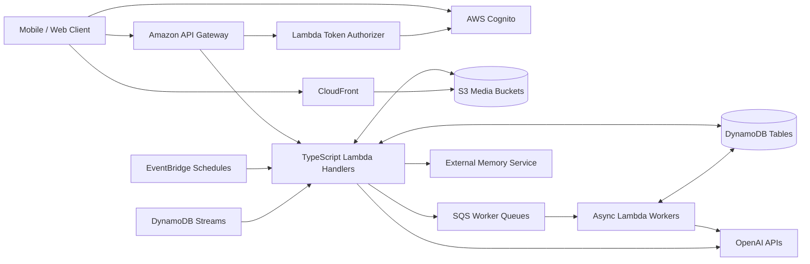
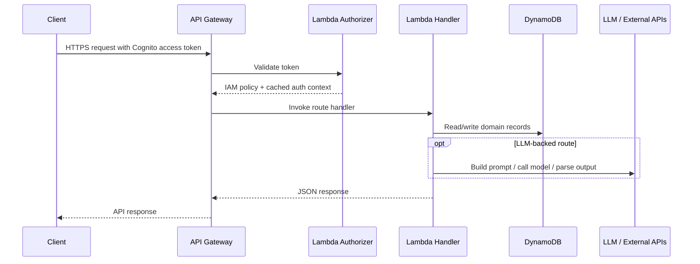
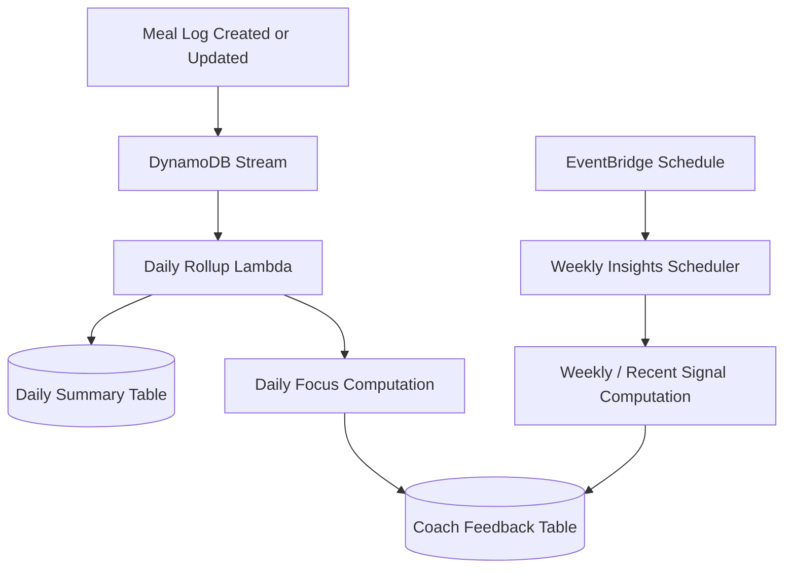

# CoachKai Backend Architecture Overview

CoachKai is a serverless backend for an AI nutrition coach. It supports authenticated user profiles, meal logging, chat-based coaching, voice and photo ingestion, recipe generation, coaching insights, and content delivery.

The system is built around a few core principles:

- API-first contracts for mobile and web clients
- Serverless infrastructure managed with AWS CDK
- DynamoDB access patterns designed up front
- LLM behavior configured through versioned recipes instead of hard-coded prompts
- Offline evaluation for critical LLM tasks before production rollout
- Separation between canonical user facts, derived insights, and assistant conversation state

## High-Level System

## Main Domains

| Domain | Responsibility |
| --- | --- |
| Identity | Cognito access token validation through a custom API Gateway authorizer |
| User Profile | Profile, preferences, onboarding, account deletion, usage tracking |
| Meal Logs | Canonical user activity facts, including meals, items, summaries, and corrections |
| Coaching Chat | Session and turn storage, intent routing, memory/context assembly, LLM response generation |
| LLM Recipes | Versioned prompt components, model config, context layers, and output contracts |
| Insights | Daily focus, recent patterns, weekly signals, and read models for the client |
| Voice / Photo | Presigned upload, encrypted S3 storage, transcription/photo analysis, ingestion state tracking |
| Recipes | Generated recipes, expansion, image refresh, and async worker processing |
| Content | Curated educational bits and image assets delivered through API and CDN |

## Request Path

## Data Ownership

The backend separates data by purpose:

- User facts live in user profile, preferences, and meal log records.
- Conversation state lives in chat session and chat turn tables.
- Derived coaching insight read models live in coach feedback records.
- Durable assistant action/focus state lives in Kai Loop records.
- Upload lifecycle state lives in ingestion records.
- Generated recipe state lives in recipe records and worker queues.

This separation makes each read path explicit and avoids mixing canonical nutrition facts with assistant-generated guidance.

## Event-Driven Paths

## Why This Architecture Works

- API Gateway and Lambda keep operational overhead low.
- CDK gives repeatable infrastructure and environment-specific behavior.
- DynamoDB supports predictable low-latency reads when access patterns are modeled directly.
- SQS isolates slower LLM and image generation work from request-response APIs.
- EventBridge and DynamoDB Streams let derived insight computation run outside user-facing request paths.
- Versioned LLM recipes allow prompt changes, model changes, and output changes without scattering prompt logic through application code.

