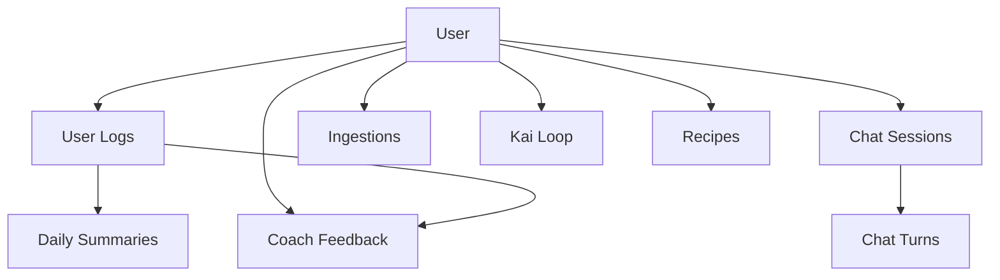
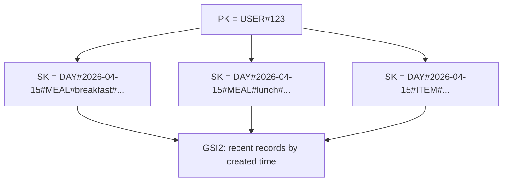
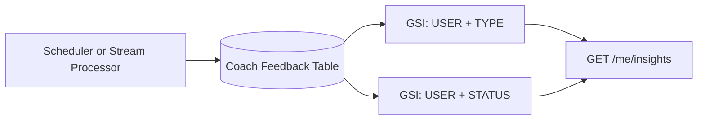
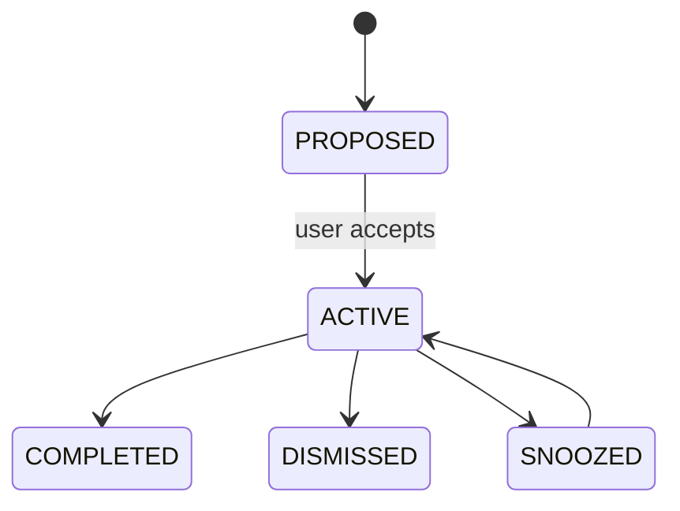
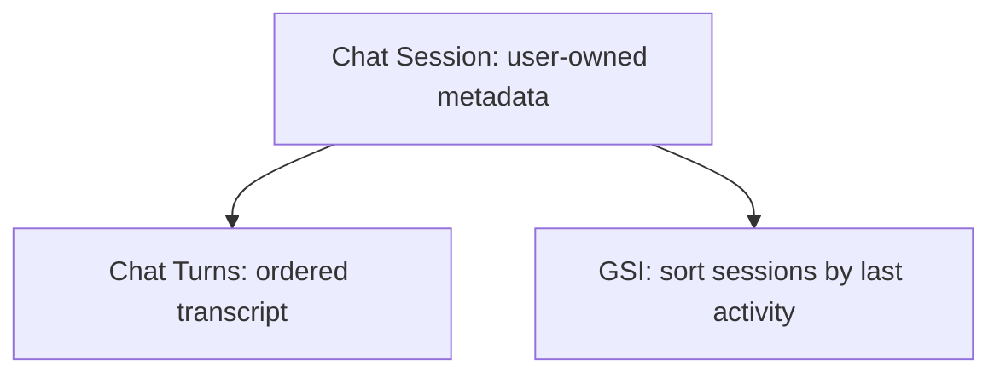

# DynamoDB Data Model

CoachKai uses DynamoDB for low-latency access to user profiles, meal logs, chat sessions, chat turns, coaching feedback, ingestion jobs, recipes, content, and derived assistant state.

The data model is designed around explicit access patterns rather than relational joins.

## Modeling Principles

- Model the query first.
- Use composite partition and sort keys.
- Prefer `Query` and `GetItem`; avoid scans in user-facing paths.
- Keep canonical facts separate from derived assistant guidance.
- Use GSIs for alternate read patterns.
- Use TTL for temporary lifecycle records.
- Use environment-aware retention and point-in-time recovery for production tables.

## Table Overview

| Table | Purpose |
| --- | --- |
| Users | Profile, preferences, onboarding, account deletion metadata |
| User Logs | Canonical user activity and meal records |
| Daily Summaries | Derived daily nutrition summaries |
| Coach Feedback | Read model for daily focus, recent patterns, and weekly insights |
| Kai Loop | Durable assistant action items, insights, and focus state |
| Chat Sessions | Chat session metadata |
| Chat Turns | User and assistant turns within a session |
| Ingestions | Voice/photo upload lifecycle tracking |
| User Usage Daily | Daily usage counters and limits |
| Recipes | Generated recipes and recipe state |
| Saved Items | User-saved content references |
| Bits | Curated content CMS records |
| Lesson Progress | Per-user lesson viewed/saved state |
| Scheduled Runs | State for chunked scheduled jobs |

## Core Entity Relationships



## User Records

User-owned records use a user partition key pattern:

```text
PK = USER#{userId}
SK = PROFILE | PREFERENCES | ONBOARDING | ...
```

Common access patterns:

- Get profile by user id
- Get preferences by user id
- Lookup by email through a GSI for admin/support workflows

## User Logs

Meal logs are canonical user facts. Derived analysis and summaries are computed from these records rather than replacing them.

```text
PK = USER#{userId}
SK = DAY#{YYYY-MM-DD}#...
```

Common access patterns:

- Query all logs for a user on a local day
- Query recent logs for a user
- Query meal items by day and meal key
- Recompute summaries from source records



## Coach Feedback Read Model

Coach feedback stores generated insight read models for the client.

Examples:

- same-day focus
- recent pattern
- weekly insight

```text
PK = USER#{userId}
SK = FEEDBACK#{type}#{date_or_id}
```

Common GSIs:

- query by user and feedback type
- query by user and status
- lookup by feedback id for updates



## Kai Loop Table

Kai Loop stores assistant-derived action and focus state. It is not the canonical meal log.

```text
PK = USER#{userId}
SK = ACTION#{actionId}
SK = INSIGHT#{createdAt}#{insightId}
SK = FOCUS#{focusId}
SK = FOCUS#DAY#{YYYY-MM-DD}
```



Access patterns:

- Get today’s active focus pointer
- Get focus details by id
- Query active action items
- Attach future focus records to days or meals through reserved GSIs

## Chat Tables

Chat state is split into session metadata and turn history.



Common access patterns:

- list sessions for a user
- list sessions by last activity
- get a session by id
- query recent turns for a session
- append user and assistant turns

## Ingestion Records

Ingestion records track upload lifecycle for voice and photo.

```text
PK = INGESTION#{uploadId}
SK = META
```

Core fields:

- user id
- ingestion type
- status
- S3 key
- content type
- timestamps
- TTL
- transcript or photo description result
- error code/message when failed

## Access Pattern Summary

| Access Pattern | DynamoDB Strategy |
| --- | --- |
| Load profile/preferences | `GetItem` by user PK/SK |
| Fetch logs for a day | `Query` user partition with day sort-key prefix |
| Fetch recent logs | GSI ordered by creation time |
| Fetch active insights | GSI by user and status |
| Fetch insights by type | GSI by user and type |
| Fetch chat turns | `Query` by session partition |
| Fetch today focus | `GetItem` / targeted query by user and day |
| Track upload status | `GetItem` / `UpdateItem` by ingestion id |

