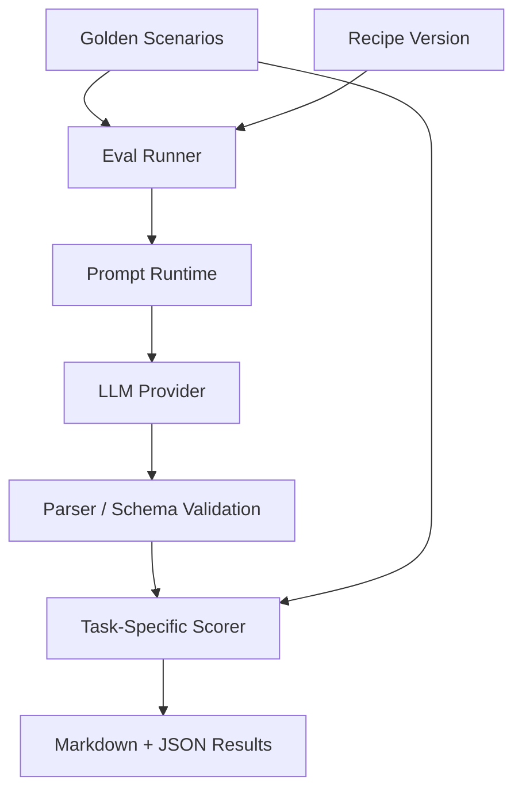
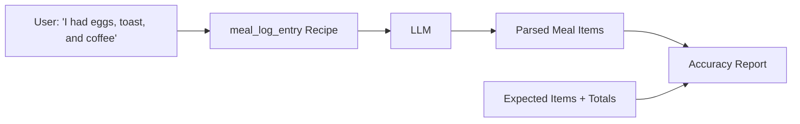
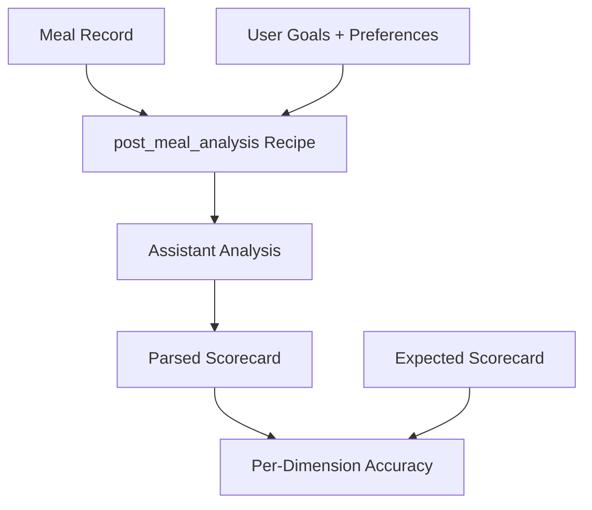
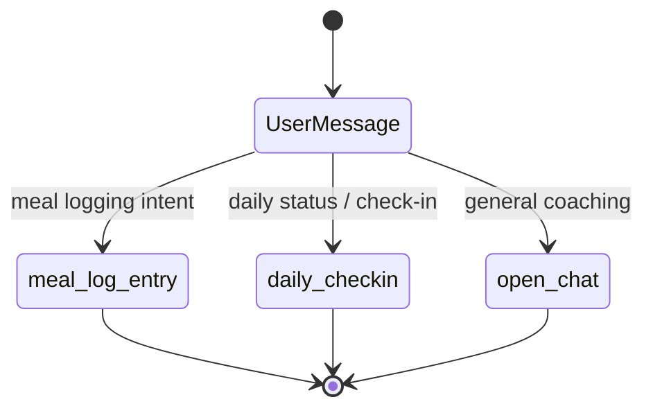

# LLM Evaluation

CoachKai uses offline evaluation assets to test LLM behavior before changing production recipes. The evaluation system focuses on repeatable golden scenarios, versioned recipes, structured scoring, and persisted reports.

## Evaluation Goals

- Catch regressions before deployment
- Compare recipe versions objectively
- Evaluate structured output correctness
- Test edge cases that are expensive or risky to discover in production
- Create a feedback loop between prompt changes, model changes, and product quality

## Evaluation Architecture

## Golden Scenario Shape

Golden scenarios encode realistic user inputs and expected outputs. For a meal logging task, a scenario can include:

- user message
- optional session context
- expected food items
- expected quantities and units
- expected calories and macros
- expected meal totals

For an analysis task, a scenario can include:

- meal details
- user goal context
- expected scorecard dimensions
- expected qualitative classification

## Meal Log Entry Evaluation

Meal log entry evaluation tests whether the LLM can convert natural language into structured nutrition data.

The scorer compares:

- item count
- item labels
- quantities and units
- item-level nutrition values
- total calories and macros
- weighted nutrition accuracy

Tolerance-based scoring is used because food estimates are naturally approximate.

## Post-Meal Analysis Evaluation

Post-meal analysis evaluation tests whether the assistant can assess a meal across nutrition dimensions.

Example scorecard dimensions:

- protein
- fiber
- calorie density
- food quality
- goal fit

Weighted scoring can emphasize high-impact dimensions such as calorie density or goal fit.

## Intent Router Evaluation

Intent routing is evaluated separately because routing failures can send a user message into the wrong downstream recipe.

The classifier is optimized for:

- low latency
- deterministic JSON output
- minimal context
- low cost model selection
- clear routing rules

## Promotion Workflow

## Report Outputs

Each evaluation run can produce:

- Markdown reports for human review
- JSON results for machine comparison
- scenario-level pass/fail data
- expected-vs-actual comparisons
- aggregate accuracy metrics
- recipe version metadata

## Evaluation Principles

- Use stable golden scenarios for regression testing.
- Keep recipe versions immutable.
- Score structured outputs with deterministic code where possible.
- Use human review for tone, safety, and coaching quality.
- Store reports so model and prompt changes can be compared over time.

