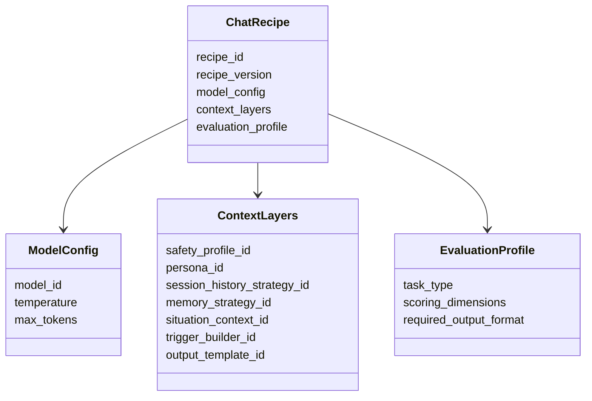
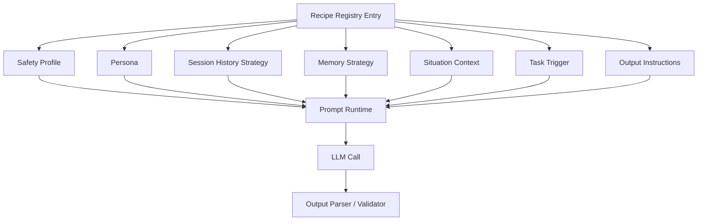
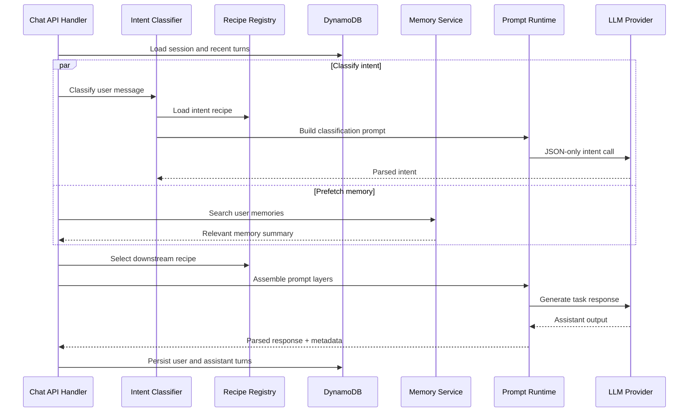
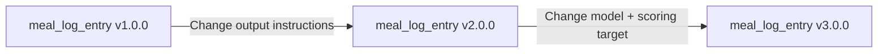

# LLM Recipe System

CoachKai uses a recipe-based LLM architecture. A recipe is a versioned configuration that defines the model, context layers, prompt components, output contract, and evaluation profile for a specific assistant capability.

This keeps LLM behavior observable, testable, and rollback-friendly.

## Problem

Hard-coded prompts become difficult to maintain as an assistant gains more use cases:

- meal logging
- meal correction
- post-meal analysis
- snack analysis
- daily check-ins
- open-ended chat
- recipe generation
- image prompt generation
- intent classification

Each task needs different context, output shape, model settings, and evaluation criteria. The recipe system makes those choices explicit.

## Recipe Model

## Prompt Assembly

## Runtime Flow

## Supported Recipe Types

| Recipe | Purpose |
| --- | --- |
| `intent_classifier` | Route a user message to the correct downstream task |
| `meal_log_entry` | Convert natural language into structured meal log output |
| `meal_correction` | Update existing meal records based on user corrections |
| `post_meal_analysis` | Score and explain a logged meal |
| `post_snack_analysis` | Provide snack-specific feedback |
| `daily_checkin` | Generate daily coaching messages |
| `open_chat` | Handle general coaching conversation |
| `next_meal_ideas` | Suggest next meals based on context |
| `full_recipe_generation` | Generate complete structured recipes |
| `recipe_image_prompt` | Generate image prompts for recipe images |

## Versioning Strategy

Each layer can evolve independently:

- model version
- safety profile
- persona
- memory strategy
- session history formatting
- situation context builder
- task trigger
- output instructions
- schema or parser

Versioned recipes make it possible to compare behavior across versions and roll back by changing configuration rather than rewriting application logic.

## Observability

Each LLM call should be traceable by:

- recipe id
- recipe version
- component ids
- model id and parameters
- input context summary or hash
- parsed output
- latency
- token usage
- downstream outcome signals

This metadata supports debugging, evaluation, and controlled rollout decisions.

