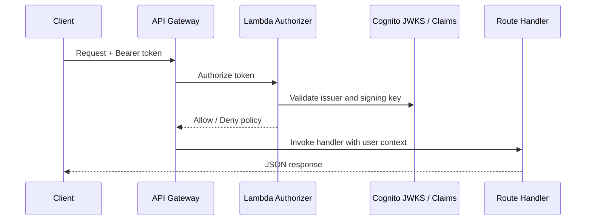
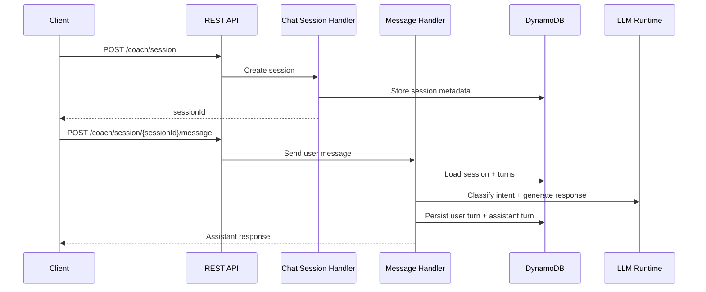
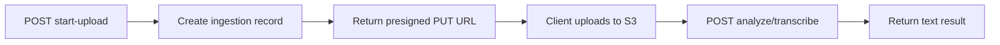
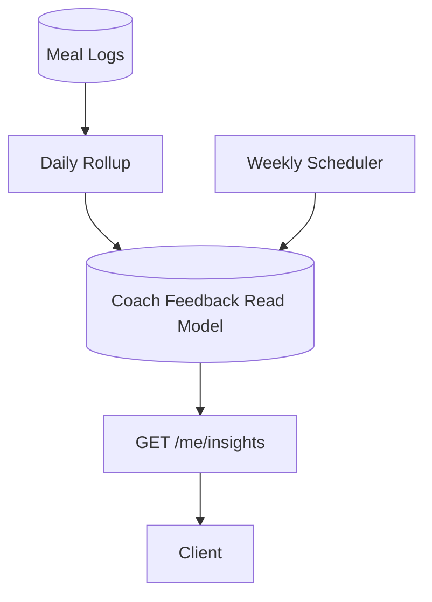

# REST API Contract

CoachKai exposes a REST API for authenticated user data, coaching chat, meal logs, media ingestion, insights, recipes, feedback, and content.

This document is a public-safe summary of the API design. It omits real environment URLs, account identifiers, and private operational values.

## API Design Principles

- JSON request and response bodies
- Cognito access token authentication for private routes
- Explicit public routes for public content and waitlist flows
- Resource-oriented paths
- Cursor-based pagination for list endpoints
- Idempotent or patch-oriented updates where appropriate
- Clear separation between canonical logs, generated insights, and chat state

## Authentication

Most endpoints require a bearer token:

```http
Authorization: Bearer <cognito_access_token>
Content-Type: application/json
```

API Gateway invokes a custom Lambda authorizer that validates the token issuer, signature, audience/client, and expiry.



## Resource Groups

| Resource Group | Example Routes | Purpose |
| --- | --- | --- |
| User | `/me/bootstrap`, `/me/profile`, `/me/preferences`, `/me/onboarding` | Profile and app startup state |
| Account | `/me/account/deletion-request` | User-initiated account deletion request |
| Logs | `/me/logs`, `/me/logs/recent`, `/me/logs/meal/correction` | Meal and activity log retrieval/correction |
| Summary | `/me/summary` | Daily or range summaries |
| Insights | `/me/insights` | Daily focus, recent patterns, weekly insights |
| Chat | `/coach/session`, `/coach/session/{sessionId}/message` | Coaching sessions and turns |
| Voice | `/voice/start-upload`, `/voice/uploads/{id}/transcribe` | Audio upload and transcription |
| Photo | `/photo/start-upload`, `/photo/uploads/{uploadId}/analyze` | Image upload and food description |
| Recipes | `/v1/recipes`, `/v1/recipes/{recipeId}` | Recipe generation and management |
| Content | `/bits`, `/bits/{bitId}` | Public educational content |
| Feedback | `/feedback` | In-app feedback submission |
| Waitlist | `/waitlist` | Public waitlist signup |

## Chat API Flow



## Media Ingestion API Flow



## Insight API Pattern

Insights are read models created by scheduled or stream-based backend jobs.



Clients can query insights by type and status, for example:

```http
GET /me/insights?type=TODAY_FOCUS&status=ACTIVE
```

## Common Response Patterns

Successful object response:

```json
{
  "profile": {
    "displayName": "Example User",
    "email": "user@example.com"
  }
}
```

List response with pagination:

```json
{
  "items": [],
  "nextCursor": "opaque-cursor-value"
}
```

Accepted async job:

```json
{
  "status": "queued",
  "jobId": "job_123"
}
```

Structured error:

```json
{
  "error": "BadRequest",
  "message": "Invalid request body"
}
```

## REST Design Notes

- `GET` routes retrieve resources or lists.
- `POST` routes create resources or trigger domain actions.
- `PUT` routes replace or mark deterministic state.
- `PATCH` routes partially update mutable state.
- `DELETE` routes remove user-owned resources where supported.
- Upload APIs separate media transfer from analysis so clients can upload directly to S3 without proxying large files through Lambda.

