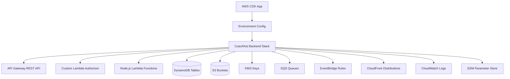
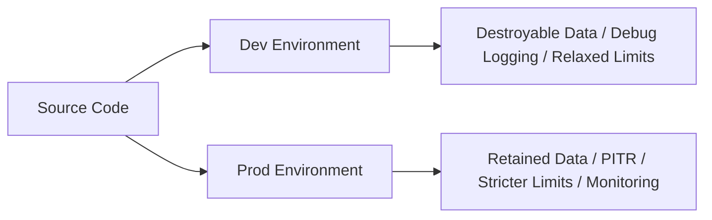
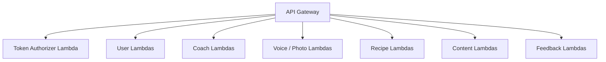
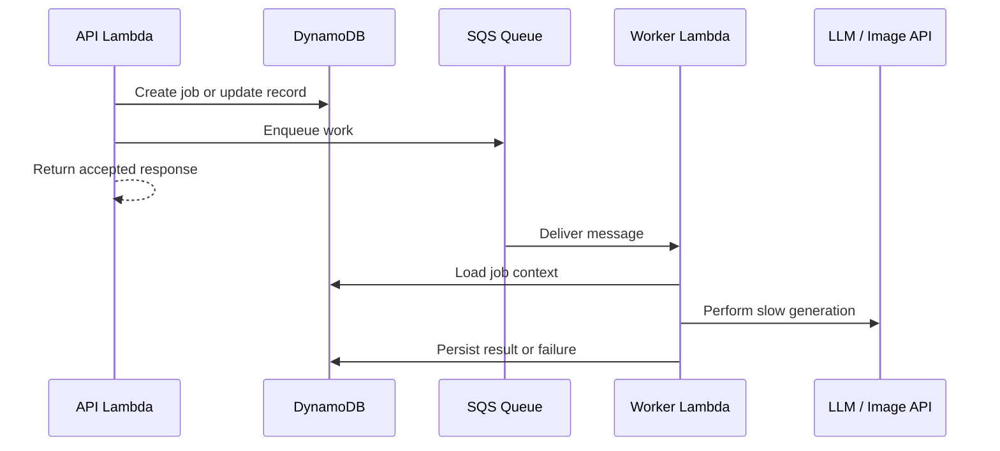
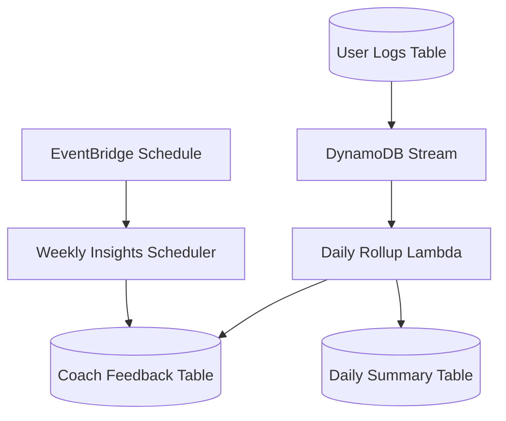
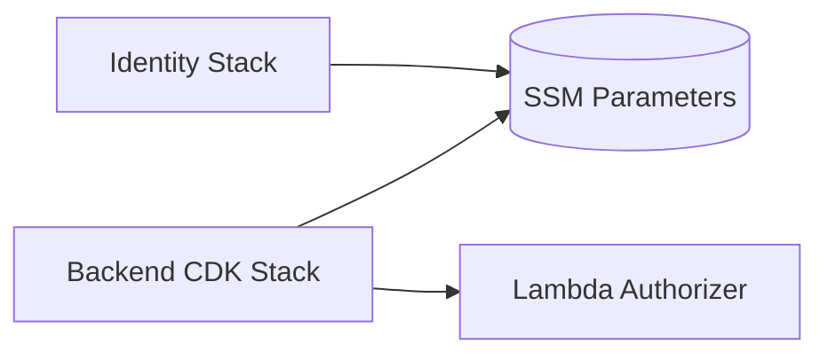

# Serverless CDK Architecture

CoachKai infrastructure is defined with AWS CDK and deployed as environment-specific serverless stacks. The backend is built primarily with API Gateway, Lambda, DynamoDB, S3, SQS, EventBridge, KMS, CloudFront, and Cognito integration.

## Infrastructure Overview

## Main AWS Services

| Service | Usage |
| --- | --- |
| API Gateway | REST API routing, CORS, authorizer integration |
| Lambda | TypeScript route handlers, stream processors, scheduled jobs, async workers |
| DynamoDB | User profiles, logs, chat sessions, chat turns, feedback, ingestion records, recipes |
| S3 | Voice uploads, photo uploads, recipe images, content assets |
| KMS | Server-side encryption for media uploads |
| SQS | Async recipe generation, image generation, and meal analysis workers |
| EventBridge | Scheduled weekly/recent insight jobs |
| DynamoDB Streams | Daily rollup and same-day focus recomputation |
| CloudFront | Public delivery for selected content and generated assets |
| SSM Parameter Store | Cross-stack configuration such as Cognito resource identifiers |
| CloudWatch Logs | Lambda logging and operational debugging |

## Environment Strategy

The stack uses environment-specific configuration for:

- resource names
- removal policies
- point-in-time recovery
- usage limits
- alerting and monitoring behavior
- deployment target

Production resources retain durable data, while development resources can be easier to tear down and recreate.

## API Gateway and Lambda

The backend uses dedicated Lambda handlers by domain rather than one monolithic handler. This keeps IAM permissions, environment variables, timeouts, and operational behavior easier to reason about.

## Async Worker Pattern

This pattern keeps slow or expensive LLM work out of latency-sensitive API routes.

## Scheduled and Stream Processing

Scheduled jobs compute weekly and recent insights. Stream processors recompute daily summaries and same-day focus when meal logs change.

## Cross-Stack Configuration

The backend reads shared identity resources from SSM Parameter Store. This allows the identity stack and backend stack to be deployed independently while still sharing Cognito identifiers and issuer metadata.

## CDK Design Choices

- CDK constructs define API routes, tables, buckets, queues, workers, and permissions in code.
- Lambda bundling supports TypeScript, markdown prompt assets, and JSON recipe artifacts.
- DynamoDB tables use environment-aware retention and point-in-time recovery.
- S3 uploads are encrypted and signed through short-lived presigned URLs.
- API routes consistently use Cognito-backed authorization except explicitly public endpoints.

