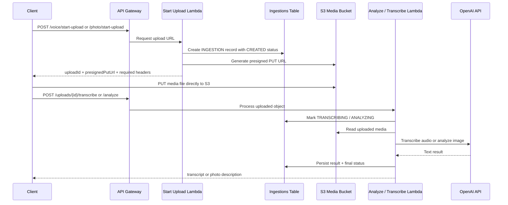
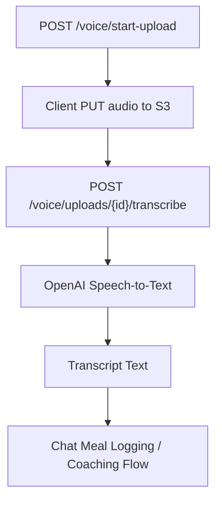
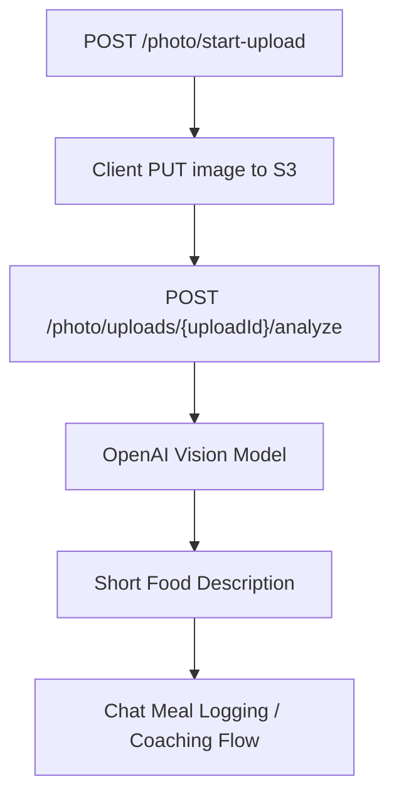
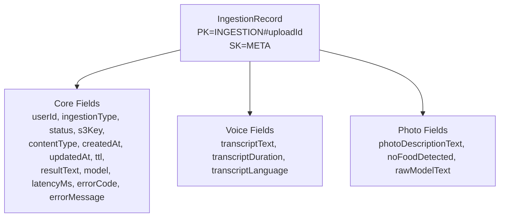
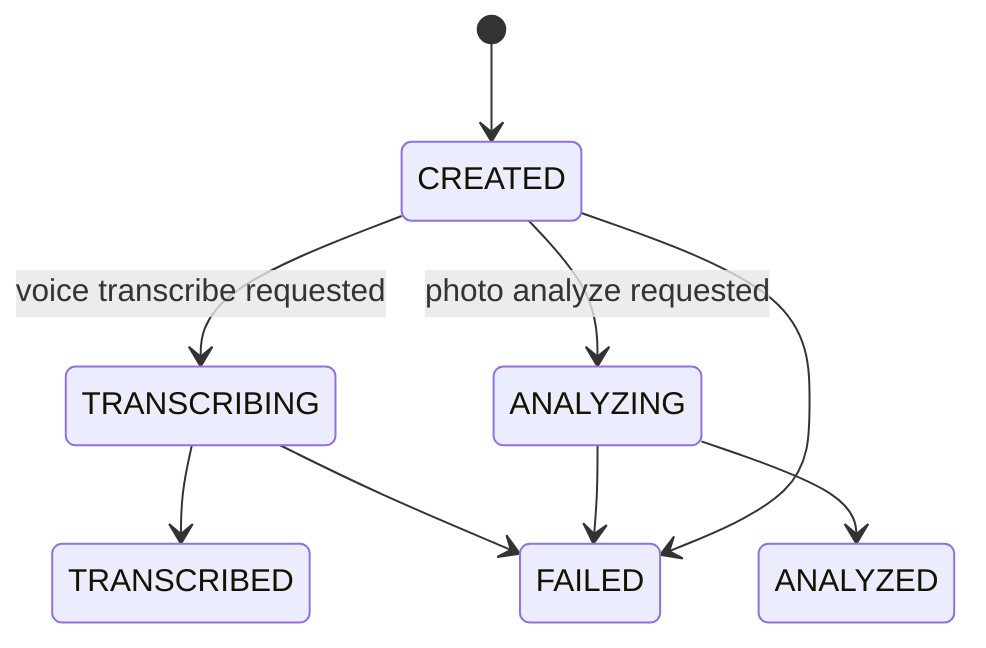
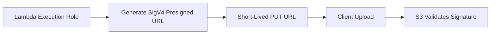

# Voice and Photo Ingestion

CoachKai supports voice and photo inputs through a direct-to-S3 upload flow. The backend issues short-lived presigned URLs, tracks ingestion state in DynamoDB, and performs transcription or photo analysis after the client uploads media.

## Design Goals

- Avoid sending large media payloads through API Gateway and Lambda
- Keep uploads encrypted at rest
- Track upload lifecycle server-side
- Return useful text back to the client for downstream coaching flows
- Keep structured food interpretation in the chat/LLM recipe system

## Shared Upload Flow



## Voice Flow



Voice ingestion returns transcript text. Food interpretation happens later in the chat flow so the same meal logging recipe can handle typed, voice-transcribed, and photo-described inputs consistently.

## Photo Flow



Photo ingestion returns a short human-readable description. Structured nutrition parsing is intentionally handled downstream by the chat recipe system.

## Ingestion Record Model



## Status Lifecycle



## S3 Object Layout

Media objects use environment, domain, user, date, and upload id in the key.

```text
{environment}/coach-kai/audio/{userId}/{YYYY}/{MM}/{DD}/{uploadId}.{ext}
{environment}/coach-kai/photo/{userId}/{YYYY}/{MM}/{DD}/{uploadId}.{ext}
```

This makes objects easy to inspect operationally while keeping access controlled through IAM and presigned URLs.

## Presigned URL Security



The signed upload request includes:

- object key
- HTTP method
- expiration
- content type
- encryption headers
- credential scope
- signature

The client must upload with the required signed headers. If headers differ, S3 rejects the upload because the signature no longer matches.

## Why Direct Uploads

Direct-to-S3 uploads avoid:

- API Gateway payload limits
- Lambda memory pressure from binary uploads
- unnecessary backend bandwidth
- long request times for media transfer

The backend still controls who can upload, where the object lands, how long the URL is valid, and how ingestion state is recorded.

